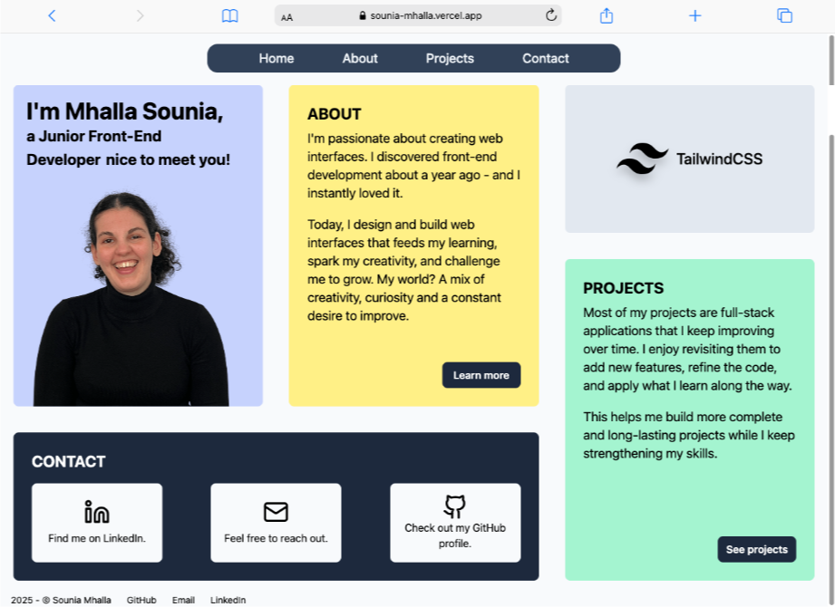
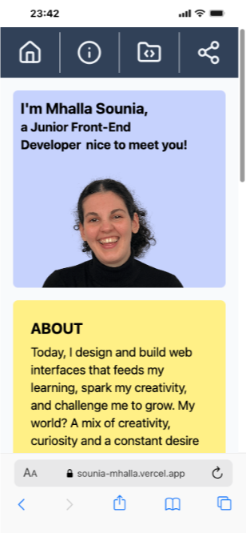
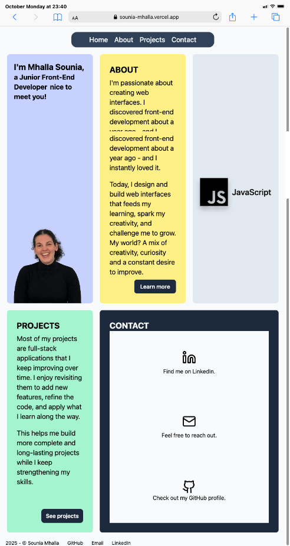

# Portfolio


## Live Demo

Check out my Portfolio project here:
[https://sounia-mhalla.vercel.app/](https://sounia-mhalla.vercel.app/)

## Table of Contents

- [Portfolio](#portfolio)
  - [Live Demo](#live-demo)
  - [Table of Contents](#table-of-contents)
  - [Introduction](#introduction)
    - [Technologies stack](#technologies-stack)
  - [Installation](#installation)
    - [Clone the repository](#clone-the-repository)
    - [Install dependencies](#install-dependencies)
  - [Usage](#usage)
  - [Features](#features)
  - [License](#license)

## Introduction

This project showcases my work, my career path, and my passion for creating modern, accessible, and intuitive interfaces.

It brings together my most accomplished projects, built with React, TailwindCSS, and other front-end technologies. This site allows me to highlight my identity as a developer and share my progress.

<div style="display: flex; flex-wrap: wrap; justify-content: space-between; align-items:center; width: 100%; margin:auto;">




</div>

### Technologies stack

The following stacks are those that have been used in the project:

```
| Front-End    |
| ------------ |
| React.js     |
| JavaScript   |
| TailwindCSS  |
```

## Installation

### Clone the repository

To get the project on your local device, run this command in your terminal:

```
git clone https://github.com/vickyfrosties/Portfolio.git
```

### Install dependencies

Now, to install all the dependencies, you have to install the package manager (`node_modules`).

With `npm` as the package manager, run these commands:

- Client (_Portfolio/client/_)

```
Portfolio/client/
npm install
```

With `yarn` as the package manager, run these commands:

- Client (_Portfolio/client/_)

```
cd Portfolio/client/
yarn install
```

## Usage

To run the project, execute the following command on the terminal:

```
npm run dev
```

## Features

This project features that are currently available:

- API fetch request
- TailwindCSS for styling
- Responsive and clean UI

## License

This project is for demonstration purposes only.

All rights reserved © 2025 Sounia Mhalla.
